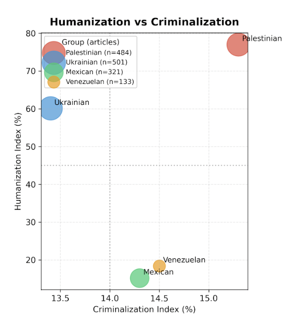

# Threat by Association
*A Corpus-Based Analysis of the Discursive Criminalization of Migrants and Displaced Communities*  

Malorie Iovino  
MSc Candidate in Computational Linguistics, Goldsmiths, University of London  

Prepared for **AMLI 2025 Conference**
Liverpool Hope University, September 2025

---

##  Overview
This repository contains the paper and presentation slides for my AMLI 2025 conference project, Threat by Association. The research investigates how Western, English-language media discursively constructs displaced populations, criminalizing some groups while humanizing others.

Using a mixed-methods framework that combines computational linguistics with Critical Discourse Analysis (CDA), the study explores how lexical choices, and grammatical constructions function as ideological tools. 

---

## Research Question 
How do Western media outlets use linguistic choices to construc displaced people differently across racial, religious, and geopolitical identities?

---

## Key Contributions 
- **Corpus-based evidence:** Analysis of 1,700+ articles from CNN and The Guardian (2021–2025), plus partisan outlets (Fox News, Daily Mail, New York Times, The Independent).
- **Computational methods:**
  - Collocation and frequency analysis
  - Part-of-speech tagging and transitivity analysis
  - Comparative distributions of evaluative adjectives + verbs
- **Critical Discourse Analysis (CDA):**
  - Headlines + URL framing
  - Case studies covering *Anas al-Sharif* and *Kilmar Abrego Garcia*

---

##  Repository Structure
```plaintext
docs/
  ├── threat_by_association.pdf        # Final paper
  └── amli_threat_by_association_slides.pptx  # Conference slides

scripts/
  ├── cnn_corpus.py
  ├── data_collection.py
  └── evaluation.py

data/
  ├── cnn_guardian_corpus.csv
  └── supplementary.csv

figures/
  ├── collocation_plot.png
  └── agency_analysis.png
```
## Methods
- **Corpus Construction:**
  - CNN articles via GDELT + scraping
  - Guardian articles via Open Platform API
  - Supplementary partisan outlets (Fox News, Daily Mail, New York Times, The Independent)
- **Analytical Tools:**
  - Lexical choice analysis
  - Collocation patterns (5-word windows, log-likelihood)
  - Transitivity analysis (Halliday's SFG)
  - CDA with focus on metaphor, nominalization, and agency
    
---
## Key Findings 
The analysis reveals systematic differences in how displaced populations are framed:  

- **Palestinians** → framed as humanitarian victims but denied agency  
- **Ukrainians** → framed as complex humans with both vulnerability and rational action  
- **Mexicans/Venezuelans** → framed as administrative or criminal problems  

### Status Term Distribution  
  

This graph shows the percentage of status terms (refugee, migrant, illegal, displaced) used across groups.  
Refugee/displaced terms invoke protection under international law, while “migrant/illegal” imply choice or criminality.  

### Collocation Patterns (Table 1)  

| Group       | Top 5 words before       | Top 5 words after       |
|-------------|--------------------------|-------------------------|
| Palestinian | Israeli, killed, gaza, hamas, humanitarian | israeli, gaza, strip, killed, ministry |
| Ukrainian   | russia, support, invasion, military, help   | president, russia, forces, military, defense |
| Mexican     | border, migrants, tariffs, asylum, crossing | border, president, government, migrants, officials |
| Venezuelan  | temporary, border, migrants, haitians, held | migrants, government, president, gang, deported |

These collocations show how semantic environments differ:  
- Palestinians → violence/conflict terms  
- Ukrainians → state/strategy terms  
- Mexicans → border/enforcement terms  
- Venezuelans → governance terms

### Humanization vs Criminalization  

  

This plot shows the trade-off between sympathetic descriptors (humanization) and criminalizing frames across four displaced populations.  


| Group       |   N |   Humanization (%) |   Criminalization (%) |   Victimization (%) |   Agency (%) |
|:------------|----:|-------------------:|----------------------:|--------------------:|-------------:|
| Palestinian | 484 |               77.0 |                  15.3 |                63.8 |         13.8 |
| Ukrainian   | 501 |               60.1 |                  13.4 |                41.8 |         26.9 |
| Mexican     | 321 |               15.2 |                  14.3 |                35.1 |         24.6 |
| Venezuelan  | 133 |               18.4 |                  14.5 |                25.6 |         28.2 |

- **Palestinians** → highest humanitarian framing (77%) but lowest agency (13.8%) → grievable yet denied action.  
- **Ukrainians** → balanced as both vulnerable and rational actors, with higher agency (26.9%).  
- **Mexicans/Venezuelans** → overwhelmingly constructed as administrative or criminal problems, with very low humanization (15–18%).

--- 

## Critical Discourse Analysis & Case Studies  

### Differential Coverage of the Murder of Anas al-Sharif  

| Outlet       | Title                                               | Quote |
|--------------|-----------------------------------------------------|-------|
| **Fox News** | Israel says Al Jazeera journalist killed in airstrike was head of Hamas ‘terrorist cell’ | *An Al Jazeera journalist who was killed by an Israeli airstrike in the Gaza Strip was the leader of a Hamas "terrorist cell," the Israel Defense Forces announced…The IDF struck the terrorist Anas Al-Sharif, who posed as a journalist for the Al Jazeera network," the Israeli military said in a statement. Anas Al-Sharif served as the head of a terrorist cell in the Hamas terrorist organization and was responsible for advancing rocket attacks against Israeli civilians and IDF troops.* |
| **Daily Mail** | Israel kills Al Jazeera journalist it says was Hamas leader | *Israel's military said it targeted and killed a Hamas cell leader posing as an Al Jazeera journalist in an airstrike on Gaza City… “Al Sharif was the head of a Hamas cell and was responsible for advancing rocket attacks against Israeli civilians and IDF (Israeli) troops," the Israeli military said in a statement, citing intelligence and documents found in Gaza as evidence.* |
| **New York Times** | Israel Strike Kills Al Jazeera Journalists, Network Says | *The Israeli military…said that it had targeted “the terrorist Anas al-Sharif, who posed as a journalist for the Al Jazeera network,” and had taken steps “to mitigate harm to civilians.”… The military accused Mr. al-Sharif of being “the head of a terrorist cell” that was “responsible for advancing rocket attacks against Israeli civilians” and soldiers… But Al Jazeera and Mr. al-Sharif denied the accusation, with the network saying the allegations were “fabricated.”* |
| **The Independent** | Anas al-Sharif: Who was the Al Jazeera journalist killed by Israel? | *Since joining the Qatari broadcaster in December 2023, the father of two reported almost daily on the suffering of Palestinians in northern Gaza…. Responding to the allegations, al-Sharif said: “I, Anas Al-Sharif, am a journalist with no political affiliations. My only mission is to report the truth from the ground – as it is, without bias.”* |  

---

### Differential Coverage of the Wrongful Deportation of Kilmar Abrego García  

| Outlet       | Title                                               | Quote |
|--------------|-----------------------------------------------------|-------|
| **Fox News** | Democrats outraged that alleged gang member could be sent to Uganda<br>‘Maryland man’ Kilmar Abrego Garcia exposed in police records as 'violent' repeat wife beater | *Democrats are expressing outrage that alleged gang member and illegal immigrant Kilmar Abrego García may be deported to Uganda… (DHS) posted on its official X account, "Kilmar Abrego Garcia is not and will never be a Maryland Man—he is a criminal illegal alien from El Salvador and public safety threat." … DHS called it "insane" that "sanctuary politicians chose to glorify and stand with an MS-13 gang member over the safety of American citizens."* |
| **Daily Mail** | Migrant Kilmar Abrego García’s two word insult for Trump as he’s arrested again by ICE and branded a ‘gangbanger’ | *DHS Secretary Kristi Noem slammed 'activist liberal judges' for Abrego Garcia's release from prison… (she) said: 'Activist liberal judges have attempted to obstruct our law enforcement every step of the way in removing the worst of the worst criminal illegal aliens from our country…Today, we reached a new low with this publicity hungry Maryland judge mandating this illegal alien who is a MS-13 gang member, human trafficker, serial domestic abuser, and child predator be allowed free,' she added.* |
| **New York Times** | Abrego García Detained Again After Government Signaled It Would Re-Deport Him | *Kilmar Armando Abrego Garcia, the immigrant who was wrongfully expelled to El Salvador in March and then brought back to face criminal charges, was detained again on Monday after the administration indicated that it planned to re-deport him to Uganda.* |
| **The Independent** | Kilmar Abrego García is back in jail and facing deportation. Here’s what to know | *The Maryland construction worker, 30, was detained Monday in Baltimore by U.S. Customs and Immigration Enforcement after leaving a Tennessee jail on Friday. Administration officials have said he's part of the dangerous MS-13 gang, an allegation Abrego Garcia denies.* |  


